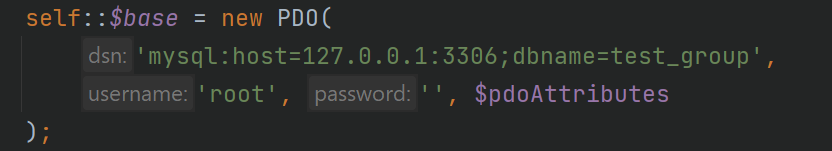
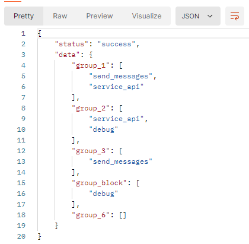
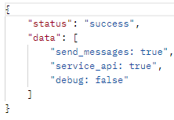
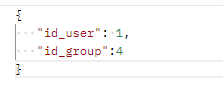
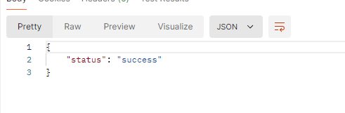
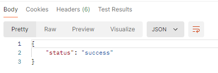

Настройка проекта:
Если ОС Widows то достаточно  поставить в OpenServer в папку domains папку проекта

Если Linux:
использовать nginx конфиг 
для локального развертывания : local
для прода: prod
выполнить доп настройку в случае возникновения ошибок

Настроить подключение в классе BasePdo

взять дамп базы:
test_group.sql

Примеры:
1) Запрос для получения групп и их прав:
METHOD: GET Url: http://api/group/getGroups
response:

2) Запрос для получения информации о пользователе:
METHOD GET URL:http://api/group/getUser?id=1
response:

    
3) Запрос для добовления пользователя в группу:
METHOD: POST URL: http://api/group/insertUser
   request:
   
   
   
   response:
   
   
4) Запрос для удаления пользователя из группы:
METHOD DELETE URL:
   http://api/group/deleteUser?id_user=1&id_group=4
   response:
   